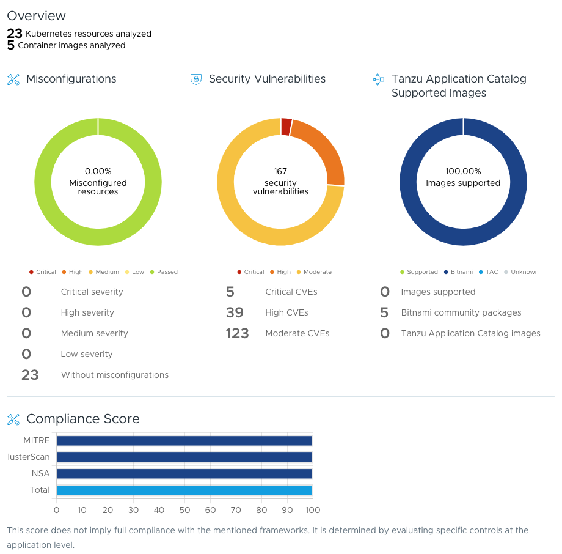

# Helm Charts - Zero to Hero

## Description

This project is a simple exercise for evaluating Open Source Helm charts security and configuration issues. It can be used along with the [Kubescape Bitnami](https://hub.docker.com/r/bitnami/kubescape) CLI tool to generate an OSS Assessment health report.

The Helm chart has the following dependencies:

- **PostgreSQL** version 0.2.4 from https://cetic.github.io/helm-charts
- **Nginx** version 0.1.0 from https://charts.mirantis.com
- **Grafana** version 6.61.2 from https://grafana.github.io/helm-charts
- **Clickhouse** version 1.0.1 from https://liwenhe1993.github.io/charts

Each dependency is tagged for easy identification and management.

All these dependencies have an equivalent chart in the [Bitnami Catalog](https://github.com/bitnami/charts) as well as in [Tanzu Application Catalog](https://app-catalog.vmware.com/catalog).

Alternative versions of the Helm chart can be found here:

* [Bitnami charts dependencies](https://github.com/agarcia-oss/zero-to-hero/tree/bitnami)
* [Tanzu Application Catalog chart dependencies](https://github.com/agarcia-oss/zero-to-hero/tree/tac)

## Executing the report

```bash
docker run --rm -it -v /tmp:/output \
        bitnami/kubescape:3.0.3 oss-assessment \
        https://github.com/agarcia-oss/zero-to-hero \
        --output /output/report.json
```

## Sample report for this repository



## Obtaining the OSS Health Assessment

Tanzu OSS Health Assessment can be found at the following URL: [Tanzu OSS Health Assessment](https://tanzu.vmware.com/oss-health-assessment). You'll need to upload the report generated from the repository (`/tmp/report.json`) there to obtain the full assessment.
